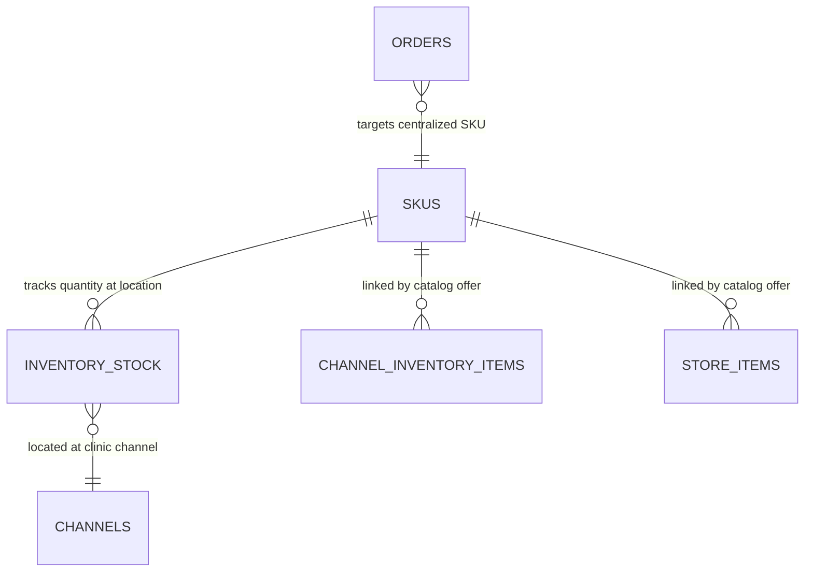
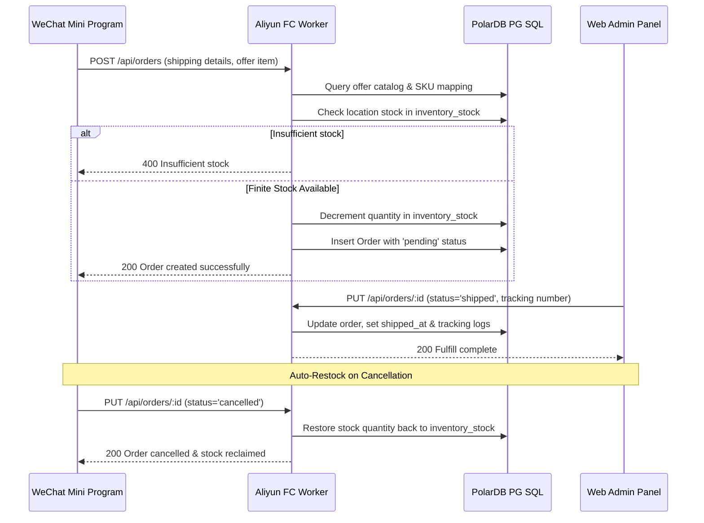

# Orders & SKU Fulfillment System

The Waven Nano precision health ecosystem employs an enterprise-grade, multi-location **SKU (Stock Keeping Unit) Registry and Order Fulfillment System**. This system decouples commercial catalog offerings (storefront listings) from raw physical or virtual inventory, enabling precise stock tracking, dynamic location-scoped stock levels, native client address collection, and sleek administrative fulfillment workflows.

---

## 1. System Architecture & Relational Schema

Instead of tracking stock directly on storefront offers (which causes duplicates and fragmented stock counts), the system introduces a normalized relational registry:

1. **`skus` (Product Registry)**: Standardizes physical assets (e.g., `KINO-CHIP-V2` for test chips, `WD-DOT-MONTHLY` for precision nutrition cartridges) or virtual items with immutable names, descriptions, types, and units.
2. **`inventory_stock` (Stock Mapping)**: Maps a `sku_id` to a specific location—either a clinical `channel_id` or a central warehouse (like `shanghai-central`)—managing the actual physical quantity and low-stock alerts.
3. **Store Catalogs (`store_items` & `channel_inventory_items`)**: Act purely as commercial **offers**. They link to a `sku_id` and define localized pricing (CNY/USD) and storefront visibility, inheriting base details if not overridden.
4. **`orders` (Shipping & Fulfillment Log)**: Captures transaction details, shipping addresses, payment status, carrier tracking numbers, and specific serials or NFC codes of the fulfilled physical assets.



### Relational Schema Definitions

#### A. Central SKUs Table (`skus`)
```sql
CREATE TABLE skus (
    id          UUID PRIMARY KEY DEFAULT gen_random_uuid(),
    sku_code    VARCHAR(100) UNIQUE NOT NULL,      -- e.g., KINO-CHIP-V2, WD-DOT-MONTHLY
    name_zh     TEXT NOT NULL,                     -- Chinese product name
    name_en     TEXT NOT NULL,                     -- English product name
    desc_zh     TEXT,                              -- Chinese product description
    desc_en     TEXT,                              -- English product description
    item_type   VARCHAR(50) NOT NULL DEFAULT 'physical', -- 'physical' | 'virtual'
    unit_zh     VARCHAR(50) NOT NULL DEFAULT '个',  -- Chinese unit
    unit_en     VARCHAR(50) NOT NULL DEFAULT 'pcs', -- English unit
    created_at  TIMESTAMPTZ NOT NULL DEFAULT NOW()
);
```

#### B. Location-Scoped Stock Table (`inventory_stock`)
```sql
CREATE TABLE inventory_stock (
    id                  UUID PRIMARY KEY DEFAULT gen_random_uuid(),
    sku_id              UUID NOT NULL REFERENCES skus(id) ON DELETE CASCADE,
    location_type       VARCHAR(50) NOT NULL,            -- 'channel' | 'warehouse'
    channel_id          INTEGER REFERENCES channels(id) ON DELETE CASCADE,
    warehouse_name      VARCHAR(100),                    -- e.g., 'shanghai-central'
    quantity            INTEGER,                         -- NULL represents unlimited
    low_stock_threshold INTEGER DEFAULT 0,
    updated_at          TIMESTAMPTZ NOT NULL DEFAULT NOW()
);
```

---

## 2. Order Checkout & Stock Management Lifecycle



### A. Infinite vs. Finite Stock Handling
* **Infinite Stock**: If `inventory_stock.quantity` is `NULL` (or no SKU is linked), the item is treated as an unlimited virtual service or digital product. Orders are approved instantly.
* **Finite Stock**: If a SKU is linked and location stock is configured, order placement enforces an atomic decrement. If the quantity drops beneath the requested amount, the check fails with a `400 Insufficient stock` exception.

### B. Auto-Restock on Order Cancellation
If an unpaid or pending order is cancelled (either by the client or an administrator), the worker automatically executes a replenishment transaction, restoring the decremented order quantity back to the corresponding `sku_id` and location in `inventory_stock`.

---

## 3. WeChat Mini Program Client Experience

The WeChat Mini Program (`src/mini/nano-miniapp`) integrates a seamless checkout experience:

* **Native Address Picker**: Integrates WeChat's native address collector `wx.chooseAddress()`. It pops up a premium, secure address selection sheet on mobile devices.
* **Fallback Address Prompts**: In simulated developer environments (WeChat DevTools) where native components might be offline, the program gracefully triggers a mock fallback form to gather recipient name, phone, and detailed address without blocking.
* **Click-to-Copy Courier Code**: Displays glassmorphic shipping cards inside order histories once marked as `shipped`, with SF Express or JD Logistics tracking numbers and a clipboard helper badge (`wx.setClipboardData`).
* **Interactive Mobile Admin Actions**: Clinic coaches or channel managers can manage shipments directly from their phone using status modals with prompt entries.

---

## 4. Web Admin Panel Fulfillment Control

The **Web Admin Panel** provides superadmins and clinic operators with high-fidelity control panel widgets:

### A. Statistical Overview
A dedicated dashboard displaying stats for Total Items, Active store listings, Total Orders, and Pending fulfillments.

### B. Collapsible Order Drawer Rows
Clicking on an order row expands a detailed glassmorphic panel containing:
* **Shipping Address Card**: Recipient Name, Contact Number, and full Street Address.
* **Fulfillment Logs**: Carrier Name, Courier Tracking Number, and Shipped/Delivered dates.
* **Transaction Metrics**: Payment Method (e.g. WeChat Pay) and Payment Status.

### C. Glassmorphic Shipment Fulfillment Modal
Operators fulfill orders by clicking the "Shipped" status dropdown, which opens a premium, blur-filtered modal collecting:
1. **Shipping Carrier**: Choose from predefined providers (SF Express 顺丰速运, JD Logistics 京东快递, China Post, etc.) or input custom carriers.
2. **Tracking Number**: Live tracking code.
3. **Fulfilled Assets**: Optionally associate pre-printed hardware identifiers (e.g. NFC chip codes like `KNC12345678-0001` or cartridge serials) with the order for hardware mapping.
4. **Fulfillment Notes**: Logistics comments.

---

## 5. Visual SKU & Stock Registry

Administrators can configure the underlying physical inventory registry using the **SKUs & Stock** subtab inside the Store management page:

* **Sku CRUD Modals**: Define raw product codes (`WD-DOT-MONTHLY`), localized names/descriptions, and base units.
* **Stock Adjuster Widget**: Lets superadmins add stock quantities to specific clinical channels or central warehouses and set low-stock warning thresholds. Low stocks trigger automatic red `⚠️ LOW` alert badges in the table.
