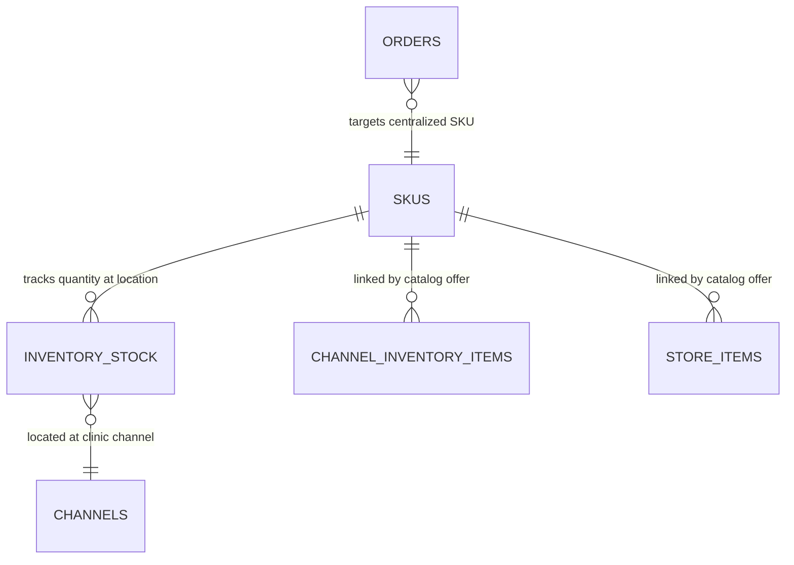
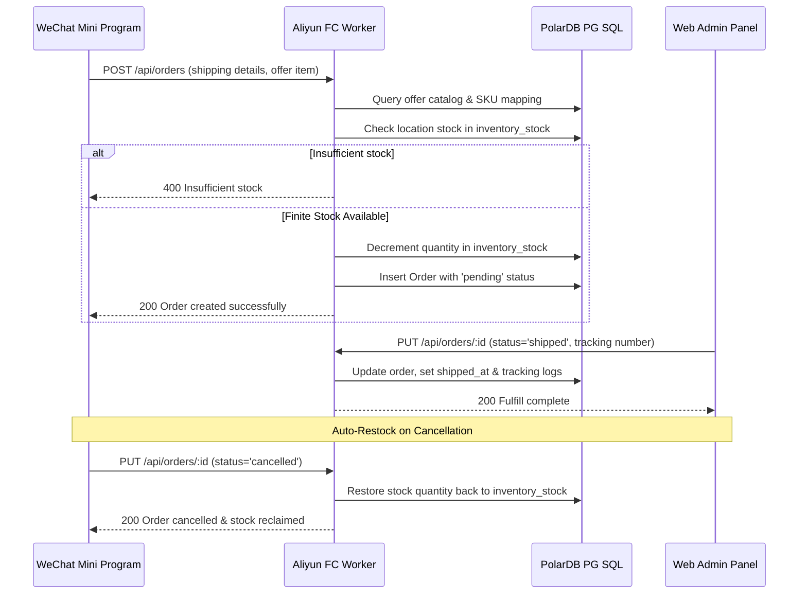

# Orders & SKU Fulfillment System

The Waven Nano precision health ecosystem employs an enterprise-grade, multi-location **SKU (Stock Keeping Unit) Registry and Order Fulfillment System**. This system decouples commercial catalog offerings (storefront listings) from raw physical or virtual inventory, enabling precise stock tracking, dynamic location-scoped stock levels, native client address collection, and sleek administrative fulfillment workflows.

---

## 1. System Architecture & Relational Schema

Instead of tracking stock directly on storefront offers (which causes duplicates and fragmented stock counts), the system introduces a normalized relational registry:

1. **`skus` (Product Registry)**: Standardizes physical assets (e.g., `KINO-CHIP-V2` for test chips, `WD-DOT-MONTHLY` for precision nutrition cartridges) or virtual items with immutable names, descriptions, types, and units.
2. **`inventory_stock` (Stock Mapping)**: Maps a `sku_id` to a specific location—either a clinical `channel_id` or a central warehouse (like `shanghai-central`)—managing the actual physical quantity and low-stock alerts.
3. **Store Catalogs (`store_items` & `channel_inventory_items`)**: Act purely as commercial **offers**. They link to a `sku_id` and define localized pricing (CNY/USD) and storefront visibility, inheriting base details if not overridden.
4. **`orders` (Shipping & Fulfillment Log)**: Captures transaction details, shipping addresses, payment status, carrier tracking numbers, and specific serials or NFC codes of the fulfilled physical assets.


```mermaid
erDiagram
    SKUS ||--o{ INVENTORY_STOCK : "tracks quantity at location"
    SKUS ||--o{ CHANNEL_INVENTORY_ITEMS : "linked by catalog offer"
    SKUS ||--o{ STORE_ITEMS : "linked by catalog offer"
    INVENTORY_STOCK }o--|| CHANNELS : "located at clinic channel"
    ORDERS }o--|| SKUS : "targets centralized SKU"
```

### Relational Schema Definitions

#### A. Central SKUs Table (`skus`)
```sql
CREATE TABLE skus (
    id             UUID PRIMARY KEY DEFAULT gen_random_uuid(),
    sku_code       VARCHAR(100) UNIQUE NOT NULL,         -- e.g., KINO-CHIP-V2, RING-SMART-M-BLK
    name_zh        TEXT NOT NULL,                        -- Chinese product name
    name_en        TEXT NOT NULL,                        -- English product name
    desc_zh        TEXT,                                 -- Chinese product description
    desc_en        TEXT,                                 -- English product description
    item_type      VARCHAR(50) NOT NULL DEFAULT 'physical', -- 'physical' | 'virtual'
    unit_zh        VARCHAR(50) NOT NULL DEFAULT '个',    -- Chinese unit
    unit_en        VARCHAR(50) NOT NULL DEFAULT 'pcs',   -- English unit
    channel_id     INTEGER REFERENCES channels(id),      -- NULL = global; set = channel-scoped
    -- Variant system (migration_sku_variants.sql)
    parent_sku_id  UUID REFERENCES skus(id) ON DELETE SET NULL, -- NULL unless this is a child/variant
    attributes     JSONB NOT NULL DEFAULT '{}',          -- {"size":"M","color":"Black"} on variants
    is_parent      BOOLEAN NOT NULL DEFAULT FALSE,       -- TRUE on the grouping/parent SKU row
    created_at     TIMESTAMPTZ NOT NULL DEFAULT NOW()
);

CREATE INDEX idx_skus_parent ON skus(parent_sku_id) WHERE parent_sku_id IS NOT NULL;
```

#### B. Location-Scoped Stock Table (`inventory_stock`)
```sql
CREATE TABLE inventory_stock (
    id                  UUID PRIMARY KEY DEFAULT gen_random_uuid(),
    sku_id              UUID NOT NULL REFERENCES skus(id) ON DELETE CASCADE,
    location_type       VARCHAR(50) NOT NULL,            -- 'channel' | 'warehouse'
    channel_id          INTEGER REFERENCES channels(id) ON DELETE CASCADE,
    warehouse_name      VARCHAR(100),                    -- e.g., 'shanghai-central'
    quantity            INTEGER,                         -- NULL represents unlimited
    low_stock_threshold INTEGER DEFAULT 0,
    updated_at          TIMESTAMPTZ NOT NULL DEFAULT NOW()
);
```

---

## 2. Order Checkout & Stock Management Lifecycle


```mermaid
sequenceDiagram
    participant User as WeChat Mini Program
    participant Worker as Aliyun FC Worker
    participant DB as PolarDB PG SQL
    participant Admin as Web Admin Panel

    User->>Worker: POST /api/orders (shipping details, offer item)
    Worker->>DB: Query offer catalog & SKU mapping
    Worker->>DB: Check location stock in inventory_stock
    alt Insufficient stock
        Worker-->>User: 400 Insufficient stock
    else Finite Stock Available
        Worker->>DB: Decrement quantity in inventory_stock
        Worker->>DB: Insert Order with 'pending' status
        Worker-->>User: 200 Order created successfully
    end
    
    Admin->>Worker: PUT /api/orders/:id (status='shipped', tracking number)
    Worker->>DB: Update order, set shipped_at & tracking logs
    Worker-->>Admin: 200 Fulfill complete
    
    Note over User, Admin: Auto-Restock on Cancellation
    User->>Worker: PUT /api/orders/:id (status='cancelled')
    Worker->>DB: Restore stock quantity back to inventory_stock
    Worker-->>User: 200 Order cancelled & stock reclaimed
```

### A. Infinite vs. Finite Stock Handling
* **Infinite Stock**: If `inventory_stock.quantity` is `NULL` (or no SKU is linked), the item is treated as an unlimited virtual service or digital product. Orders are approved instantly.
* **Finite Stock**: If a SKU is linked and location stock is configured, order placement enforces an atomic decrement. If the quantity drops beneath the requested amount, the check fails with a `400 Insufficient stock` exception.

### B. Auto-Restock on Order Cancellation
If an unpaid or pending order is cancelled (either by the client or an administrator), the worker automatically executes a replenishment transaction, restoring the decremented order quantity back to the corresponding `sku_id` and location in `inventory_stock`.

---

## 3. WeChat Mini Program Client Experience

The WeChat Mini Program (`src/mini/nano-miniapp`) integrates a seamless checkout experience:

* **Native Address Picker**: Integrates WeChat's native address collector `wx.chooseAddress()`. It pops up a premium, secure address selection sheet on mobile devices.
* **Fallback Address Prompts**: In simulated developer environments (WeChat DevTools) where native components might be offline, the program gracefully triggers a mock fallback form to gather recipient name, phone, and detailed address without blocking.
* **Click-to-Copy Courier Code**: Displays glassmorphic shipping cards inside order histories once marked as `shipped`, with SF Express or JD Logistics tracking numbers and a clipboard helper badge (`wx.setClipboardData`).
* **Interactive Mobile Admin Actions**: Clinic coaches or channel managers can manage shipments directly from their phone using status modals with prompt entries.

---

## 4. Web Admin Panel Fulfillment Control

The **Web Admin Panel** provides superadmins and clinic operators with high-fidelity control panel widgets:

### A. Statistical Overview
A dedicated dashboard displaying stats for Total Items, Active store listings, Total Orders, and Pending fulfillments.

### B. Collapsible Order Drawer Rows
Clicking on an order row expands a detailed glassmorphic panel containing:
* **Shipping Address Card**: Recipient Name, Contact Number, and full Street Address.
* **Fulfillment Logs**: Carrier Name, Courier Tracking Number, and Shipped/Delivered dates.
* **Transaction Metrics**: Payment Method (e.g. WeChat Pay) and Payment Status.

### C. Glassmorphic Shipment Fulfillment Modal
Operators fulfill orders by clicking the "Shipped" status dropdown, which opens a premium, blur-filtered modal collecting:
1. **Shipping Carrier**: Choose from predefined providers (SF Express 顺丰速运, JD Logistics 京东快递, China Post, etc.) or input custom carriers.
2. **Tracking Number**: Live tracking code.
3. **Fulfilled Assets**: Optionally associate pre-printed hardware identifiers (e.g. NFC chip codes like `KNC12345678-0001` or cartridge serials) with the order for hardware mapping.
4. **Fulfillment Notes**: Logistics comments.

---

## 5. Visual SKU & Stock Registry

Administrators can configure the underlying physical inventory registry using the **SKUs & Stock** subtab inside the Store management page (superadmin) or the Inventory → SKUs sub-tab (channel admins with `can_manage_warehouses`).

* **SKU CRUD Modals**: Define raw product codes (`WD-DOT-MONTHLY`), localized names/descriptions, and base units. See §6 for the variant/parent flow.
* **Stock Adjuster Widget**: Lets administrators add stock quantities to specific clinical channels or central warehouses and set low-stock warning thresholds. Low stocks trigger automatic red `⚠ LOW` alert badges in the table.

---

## 6. SKU Variant System

Products that come in multiple sizes, colours, or other distinguishing options are modelled with a **parent-child (variant) relationship** inside the same `skus` table.

### Data model

```
RING-SMART  (is_parent=TRUE, attributes={})
  ├─ RING-SMART-S-BLK  (parent_sku_id=RING-SMART, attributes={"size":"S","color":"Black"})
  ├─ RING-SMART-M-BLK  (parent_sku_id=RING-SMART, attributes={"size":"M","color":"Black"})
  └─ RING-SMART-M-SLV  (parent_sku_id=RING-SMART, attributes={"size":"M","color":"Silver"})
```

| Concept | Column | Notes |
|---|---|---|
| **Parent** SKU | `is_parent = TRUE` | Groups variants. Holds no stock of its own. |
| **Child / Variant** SKU | `parent_sku_id = <parent.id>` | Standalone leaf that carries its own `inventory_stock` rows. |
| **Attributes** | `attributes JSONB` | Key-value pairs describing what distinguishes this variant (e.g. `{"size":"M","color":"Black"}`). Empty `{}` on parents and standalones. |
| **Standalone** SKU | `is_parent=FALSE, parent_sku_id=NULL` | Original single-variant products — unaffected by this system. |

**Rule**: Only leaf SKUs (child or standalone) should be linked to `inventory_stock` or `store_items`/`channel_inventory_items`. Parent SKUs exist solely for grouping.

### SKU code convention

Variant codes are built as `{PARENT_CODE}-{ATTR_VALUES}`, e.g. `RING-SMART-M-BLK`. The admin modal's **Suggest code** button auto-generates this from the selected parent and filled-in attribute values.

### Migration

`src/schemas/migration_sku_variants.sql` — adds `parent_sku_id`, `attributes`, `is_parent` to existing `skus` table. Safe to apply to tables with existing rows: all three columns default to their "standalone" state (`NULL`, `{}`, `FALSE`).

### Admin panel tree view

The SKU list in both the Store tab (superadmin) and Inventory → SKUs sub-tab (channel admins) renders a **collapsible tree**:

- **Standalone rows** — flat, same as before.
- **Parent rows** — indigo-tinted row with a `PARENT` badge and chevron toggle; shows variant count in the stock column; "Add Variant" button opens the SKU modal pre-configured for that parent.
- **Child rows** (expanded) — indented below the parent with attribute chips (e.g. `M` · `Black`); carry their own stock cells and full CRUD actions.

### SKU modal — three modes

| Mode | What it creates | Extra fields shown |
|---|---|---|
| **Standalone SKU** | `is_parent=FALSE, parent_sku_id=NULL` | None |
| **Parent product** | `is_parent=TRUE` | None (children define their own attributes) |
| **Variant / Child SKU** | `parent_sku_id=<selected>` | Parent SKU picker + key-value attribute editor + Suggest Code button |
