# End User Guide

This guide covers the WeChat Mini Program experience for everyday users — chatting with your AI
health companion, testing your biomarkers, building and ordering your personalized nutrition,
joining health plan focuses, connecting a wearable ring, and using the store and learning content.

> **About the screenshots.** They are taken from a live development account on an **Aeviva**-branded
> channel, in English. Your own app may differ in two visible ways: the **name and logo in the
> header** follow your channel's branding, and your **AI companion's name and personality** are set
> by your channel (some channels use "Nano", others use "Viva"). The features work the same either
> way. A few Aeviva-only surfaces are marked as such below. Screenshots show real test data from a
> development account.

## Contents

1. [Getting Started](#getting-started)
2. [Chatting with Your AI Companion](#chatting-with-your-ai-companion)
3. [The Chat Toolbox](#the-chat-toolbox)
4. [Scanning a Kino Chip](#scanning-a-kino-chip)
5. [Your Health Tab: the Digital Twin](#your-health-tab-the-digital-twin)
6. [Connecting a Wearable Ring](#connecting-a-wearable-ring)
7. [Health Records & Documents](#health-records--documents)
8. [Viva AG: Deep Analysis](#viva-ag-deep-analysis)
9. [Health Plans (Focuses)](#health-plans-focuses)
10. [Your Dots Formulation](#your-dots-formulation)
11. [Ordering and Activating Your Dots](#ordering-and-activating-your-dots)
12. [Learn: Academy & Box](#learn-academy--box)
13. [The Store](#the-store)
14. [Notifications & Reminders](#notifications--reminders)
15. [Inviting Friends](#inviting-friends)
16. [Account & Settings](#account--settings)

---

## Getting Started

### Signing in

Opening the Mini Program signs you in automatically using your WeChat account — there is no separate
password to create. Depending on how you arrived:

- **Via a channel's own QR code or menu** — you're signed in (or an account is created) automatically.
- **Via an invite link or code** (from a friend, a coach, or an admin) — the invite ties your new
  account to that person, and you'll be asked to verify your phone number right after signing up.
- **As a guest** — if no account or invite applies, you may land in **guest mode**. You can chat and
  browse, but the Learn and Store tabs are hidden and the Health and Plans tabs are locked until you
  activate your account with an invite code.

The sign-in and phone-verification screens are shown in Chinese only.

### Verifying your phone number

Accounts created deliberately (by typing an invite code, or through a coach link) are asked to verify
a phone number by SMS code right after sign-up, and then to pick an avatar. Only **+86** numbers
receive an SMS code; other countries are recorded without one.

Verification is not a standing gate — you can use the app without it. The one place it is required is
opening the Aeviva store, which will prompt you to verify first.

### Answering onboarding questions

The first time you chat, your AI companion asks a few quick questions — name, gender, date of birth,
height and weight, and any relevant health conditions — to personalize your experience. These appear
as input bars in the chat instead of the normal message box, and only need answering once.

### Activating a guest account

Tap the lock on the Health or Plans tab, or **Sign Up** in the menu, to open the activation sheet.
Enter a 6-digit invite code (it submits automatically on the sixth digit) to unlock the full account.

---

## Chatting with Your AI Companion

The **Chat** tab is your home screen. Type a message, or hold the microphone button to dictate one,
and your AI health companion replies — answering questions about your biomarkers, your nutrition,
longevity science, your orders, or just having a conversation.

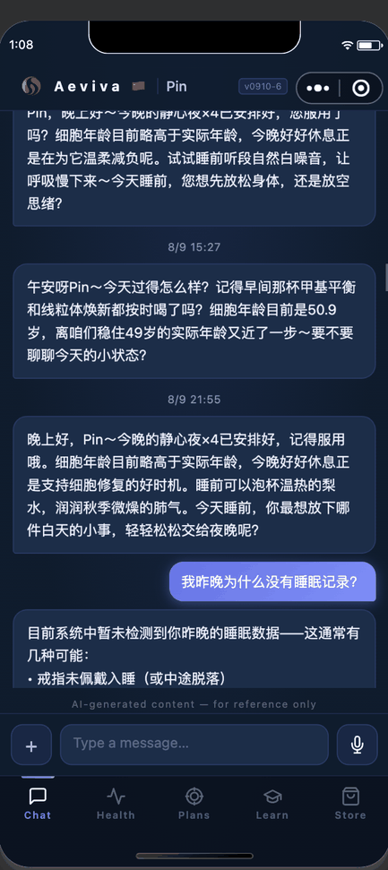

- Older messages load as you scroll up, or pull down to fetch more history.
- Replies that need in-depth analysis take longer. A status caption shows what the assistant is
  working on, and the answer is delivered as a notification when it's ready — **it is safe to leave
  the app and come back later**; nothing is lost if you close the chat.
- Some replies arrive as rich cards rather than plain text — formulation charts, product cards, and
  metric tiles with trend sparklines drawn from your own history.
- Replies attributed to **Viva AG** are results from a deep-analysis job (see
  [Viva AG](#viva-ag-deep-analysis)) and are labelled above the bubble.
- A disclaimer under the message box reminds you that responses are AI-generated and for reference
  only.

---

## The Chat Toolbox

Tap **+** to the left of the message box to open the toolbox.

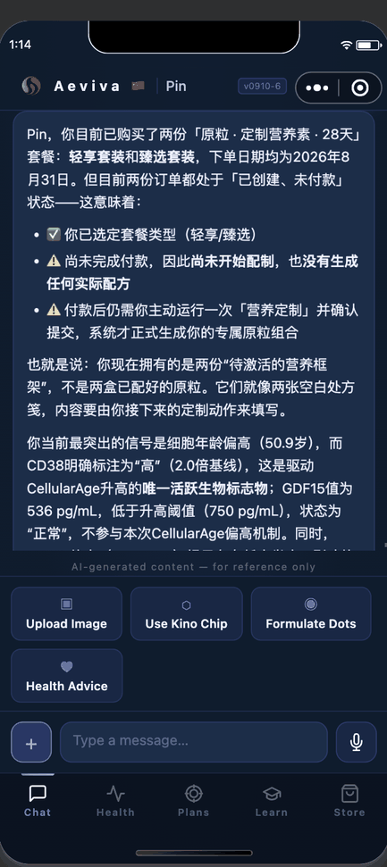

| Tool | What it does |
|---|---|
| **Upload Image** | Send a photo — useful for lab and checkup reports. If the assistant recognizes a lab report, it asks whether it's yours and offers to save it into your Health tab. |
| **Use Kino Chip** | Opens the scanner for a Kino chip's QR code (see [Scanning a Kino Chip](#scanning-a-kino-chip)). |
| **Formulate Dots** | Builds your personalized **28-day** Dots formulation from your test results and daily data. |
| **Health Advice** | Asks your companion to analyze your current health data and give you personalized advice. |

Formulate Dots and Health Advice can take anywhere from a few seconds to a couple of minutes. You'll
see a "still working" message if it runs long, and the result lands as a notification once done — no
need to keep the chat open.

The toolbox is unavailable while a reply is still being written, or while onboarding questions are
still unanswered.

---

## Scanning a Kino Chip

The Kino chip is a single-use biomarker test that measures the markers behind your biological age.

1. In the chat toolbox, tap **Use Kino Chip**.
2. Scan the QR code printed on the chip.
3. Once registered, insert the chip into the Kino Analyzer at your clinic or partner location to run
   the test.
4. When the test finishes your results appear automatically — biomarkers, BioAge and the four
   sub-ages all update, and your companion can walk you through what changed.

Each chip works once. If the code is not a valid chip, has already been used, or is registered to
another account, the chat explains exactly what happened.

---

## Your Health Tab: the Digital Twin

The **Health** tab is your **Digital Twin** — the whole picture of your health, not any single device
or test. It has four layers, and a strip near the top shows which of them currently hold data, with
the date each was last updated.

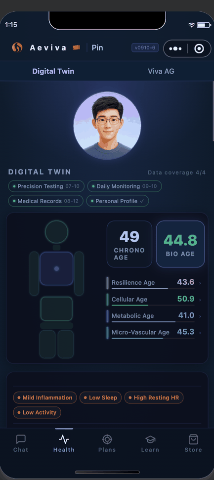

The body figure and the age cards summarize the top layer: your **BioAge** against your chronological
age, and the four sub-ages beneath it. Tap a sub-age, or a zone on the body figure, to open its own
chart; tap the BioAge card to see its trend over time.

### 1. Precision Testing

The high-precision layer, measured by the Kino chip. It shows how many tests you've taken and a card
per biomarker with a bar history: hs-CRP, GDF-15, IL-6, Glycated Albumin, Cystatin C and CD38.

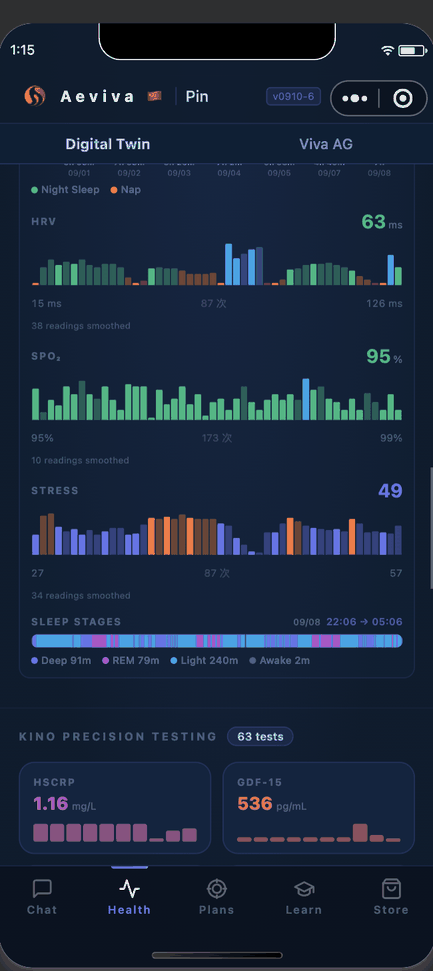
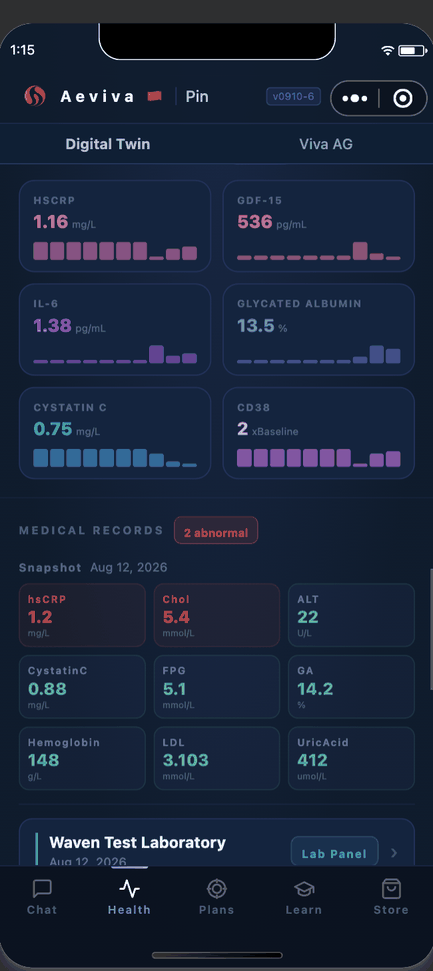

These six markers drive the four sub-ages:

| Sub-age | What it measures | From |
|---|---|---|
| **Cellular Age** | Cell vitality — NAD⁺ metabolism, senescence burden | GDF-15, CD38 |
| **Metabolic Age** | Fuel-burning efficiency and mitochondrial throughput | Glycated Albumin |
| **Micro-Vascular Age** | Capillary health, nutrient and oxygen delivery | Cystatin C |
| **Resilience Age** | Capacity to buffer stress and suppress inflammation | hs-CRP, IL-6 |

### 2. Daily Monitoring

The continuous layer, synced from your wearable ring or band. Above it sits a strip of headline
numbers — weight, BMI, today's steps, HRV, stress — each tappable into its own chart once there is
more than one reading.

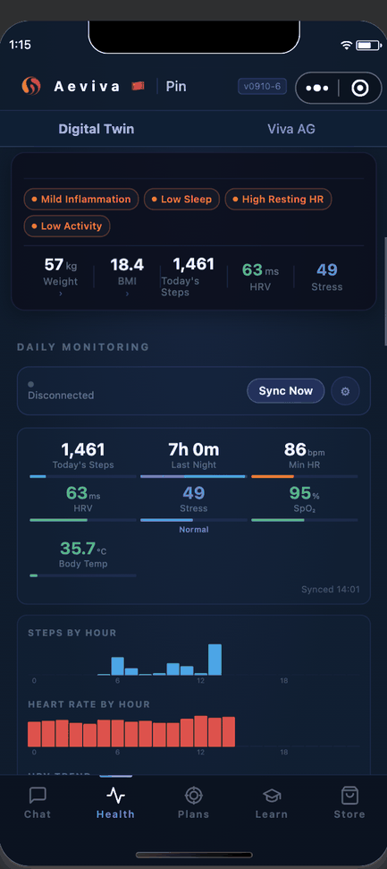

Below that are the detail charts: steps by hour, heart rate by hour, HRV and SpO₂ trends, stress, a
seven-day sleep timeline and a detailed sleep-stage breakdown, plus body composition.

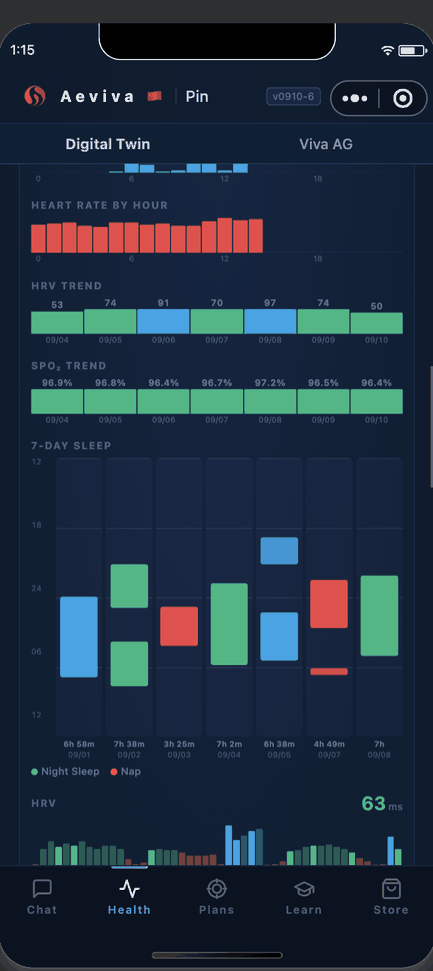

### 3. Medical Records

Lab and checkup reports from outside Waven — annual physicals, blood panels, imaging, doctor's notes.
A snapshot shows your most recent panel with each marker flagged against its reference range, and an
**abnormal** badge counts anything out of range. Below it, every report is listed by provider and
date; tap one to read the full detail.

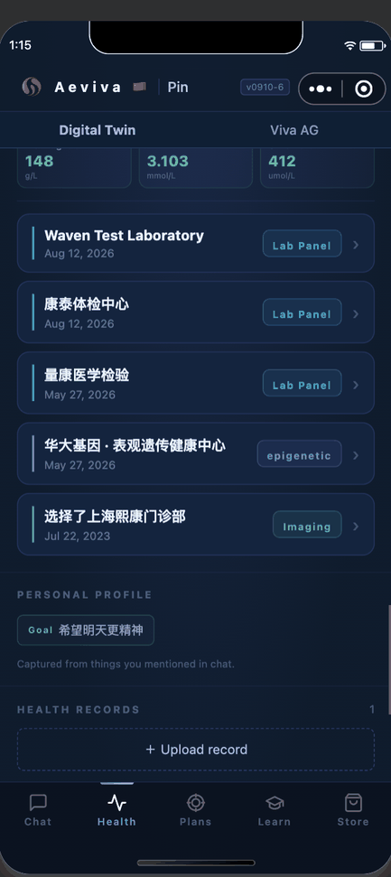

Reports reach this layer by being photographed in chat, uploaded as documents (below), or imported
from a connected lab. Values that overlap the Kino panel also feed your BioAge.

### 4. Personal Profile

What you've told us, rather than what a device measured: your name, gender, date of birth, height,
weight and BMI, your coach if you have one, and any noted conditions. Tap **Edit Profile** to change
them, or tap your avatar to pick a new one from the gallery.

This layer also lists **things you've mentioned in chat** — dietary restrictions, allergies,
preferences and goals your companion has noted and now remembers. The list is read-only; to correct
something, just say so in chat.

---

## Connecting a Wearable Ring

Only **Halo** rings (also sold as X3, X6 and X9, plus the V4 band) and **V8** smart bands are
currently supported.

1. On the Health tab, find the **Daily Monitoring** section and tap **Bind Smart Ring**.
2. The app scans for about six seconds — make sure the device is powered on and nearby.
3. Pick your device from the list to connect and bind it.
4. Once bound, tap **Sync Now** any time, or let it sync automatically when you open the tab.
5. The gear icon opens monitoring intervals — how often the ring measures heart rate, SpO₂,
   temperature and HRV — which you can change and save back to the ring.
6. **Unbind** is at the bottom of that same panel.

Once connected, steps, sleep, heart rate, HRV, stress, SpO₂ and temperature all feed the **Daily
Monitoring** layer.

---

## Health Records & Documents

At the bottom of the Digital Twin is **Health Records**, where you can keep your own medical
documents — a discharge summary, a checkup PDF, a photo of a paper printout.

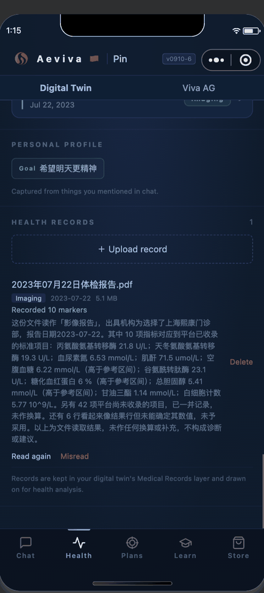

- **+ Upload record** accepts a PDF (forward it to 文件传输助手 in WeChat first, then pick it from
  there) or a photo from your album or camera.
- Each uploaded document is read automatically, and the markers it contains are pulled into your
  **Medical Records** layer. The row shows how many markers were recorded, along with a summary.
- **Read again** re-runs the extraction; **Misread** discards what was extracted from that document.
- Tap a row to open the document itself. **Delete** removes it.

Records are kept in your Digital Twin's Medical Records layer and drawn on for health analysis.

---

## Viva AG: Deep Analysis

If your account includes the **Viva AG** add-on, a second sub-tab appears at the top of the Health
tab. Viva AG runs a deep analysis over your entire Digital Twin — including the documents you've
uploaded — and takes considerably longer than a chat reply: minutes to hours, not seconds.

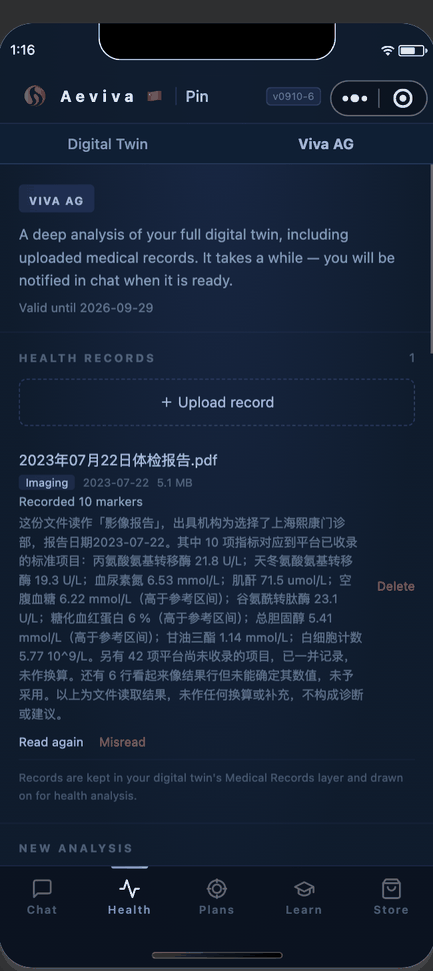

- The card at the top shows how long your access runs.
- **New analysis** offers preset topics, or a free-text request of your own. One job runs at a time,
  and there is a daily limit; the panel tells you how many you have left.
- Jobs appear in a list underneath with their status. Tap one for its detail; a queued job can be
  cancelled.
- When a job finishes, the result arrives as a chat message labelled **Viva AG**, and any report files
  it produced can be opened from the job — PDFs open in WeChat's viewer, and text or Markdown reports
  are displayed inside the app.
- An analysis may come back with a **short questionnaire** rather than a result, if it needs
  something from you before continuing. Answer it in the chat tab and the job resumes on its own.

---

## Health Plans (Focuses)

A **Health Plan** — a "focus" — is a structured, multi-week program targeting a specific goal. Find
them under **Plans ▸ Plans**.

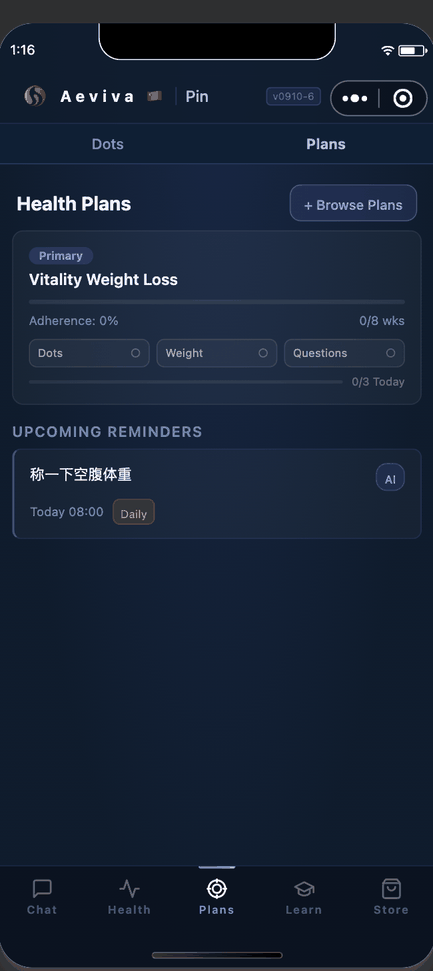

Each active plan card shows its progress, your adherence, how many weeks it runs, and **today's
tasks** as chips you tap to complete: taking your dots, logging your weight, or answering a short
daily questionnaire. Underneath, **Upcoming Reminders** lists what's due next.

### Joining a plan

Tap **+ Browse Plans** to see what's available. Each entry lists its duration and which sub-ages it
targets.

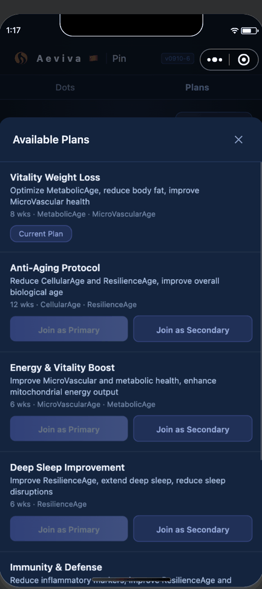

Join a plan as your **Primary** or **Secondary** focus. If that slot is already taken you'll be asked
whether to replace the plan currently in it.

### Plan detail

Tap a plan card to open it.

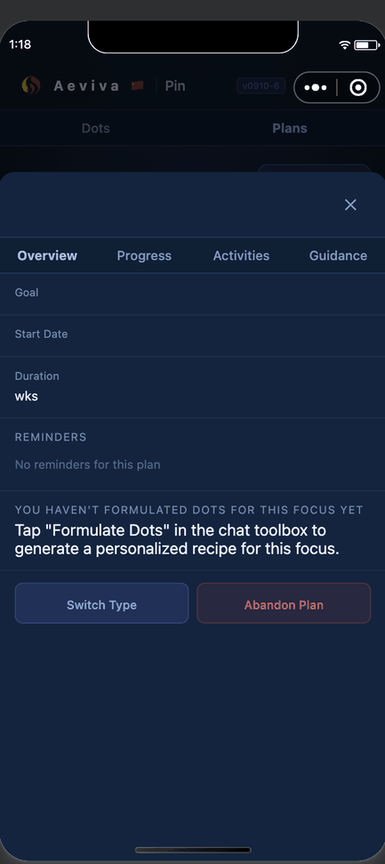

- **Overview** — goal, start date, duration, reminders you can pause or resume, and the formulation
  built for this focus (or a pointer to **Formulate Dots** if you haven't built one yet).
- **Progress** — adherence and your BioAge change against your baseline.
- **Activities** — any linked events, which you can sign up for or cancel.
- **Guidance** — the plan's written guidance.
- **Switch Type** swaps primary and secondary. **Abandon Plan** leaves it; you can rejoin later.

---

## Your Dots Formulation

Waven Dots are precision nutrition capsules, mixed to match your own biomarkers. A formulation runs a
**28-day cycle** — a morning and an evening capsule each day, 56 in total.

### Building one

Run **Formulate Dots** from the chat toolbox. If you have an active focus, you're asked first whether
to build around it:

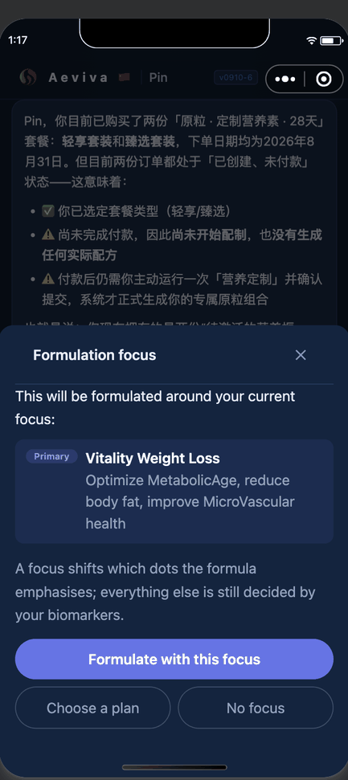

A focus shifts which dots the formula emphasizes; everything else is still decided by your
biomarkers. You can also skip the focus, or jump off to choose a plan first.

> **A Kino test is required.** Every dose is scaled by how far each sub-age sits above your
> chronological age, so without a BioAge there is nothing to scale against. If you haven't scanned a
> chip yet, the assistant says so and asks you to run a Kino test instead of producing a formula.

### Reading the formula card

The result arrives in chat as a card. It proposes **three complete packages** — one recommended for
you and open, the other two collapsed beside it. Tap any package to open it.

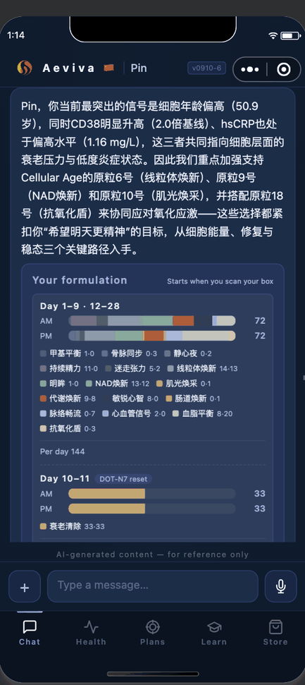

- Each package carries its store description and a line written for your own results.
- The chart shows what you'd actually take: a coloured bar per capsule, **AM** and **PM**, with the
  number of capsules on the right.
- Days that are identical are grouped — so a 28-day cycle usually reads as two rows: your everyday
  dose, and the reset days where a single dot is taken on its own.
- Days are numbered relative to the start (`Day 1–9 · 12–28`), never dated, because the capsules have
  to be compounded and shipped first. Day 1 becomes real when you scan the box.

---

## Ordering and Activating Your Dots

> This section applies to **Aeviva** channels.

Everything about your packages lives under **Plans ▸ Dots**.

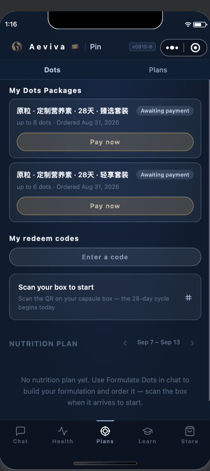

### The journey

```
formulate  →  get a redeem code from your store  →  redeem it
           →  confirm your formula  →  compounded and shipped
           →  scan the box  →  your 28-day cycle starts
```

Packages are bought with a **redeem code** that your store provides — there is no card payment inside
the app. Enter one under **My redeem codes**, either by tapping **Use it** on a code already listed
against your account, or **Enter a code** to type one in. A code can only be used once. The first time
you redeem, you'll be asked to link your store account.

### Following a package

Each package appears as a row showing its name, its tier, when it was ordered, and where it has
reached:

| Stage | What it means |
|---|---|
| **Ready to order** | A formula is built and waiting for you to order it. |
| **Awaiting payment** | The order is placed but not yet paid. |
| **Paid** | Payment cleared. |
| **Needs your formula** | The package is waiting for you — run Formulate Dots, then confirm it. |
| **Viva AG formulating** | Viva AG is building this formula. Nothing is needed from you. |
| **Expert review** | A nutrition expert is checking the recipe. |
| **Being compounded** | Your capsules are being made. |
| **Shipped** / **Delivered** | On its way, or arrived. |
| **In progress** | Activated — you're taking it, with the day counter shown. |

When a package says **Needs your formula**, tapping **Use this formula** sends your current
formulation to be compounded. That starts immediately and cannot be changed afterwards, so you're
asked to confirm.

### Activating the box

When the capsules arrive, tap **Scan your box to start** and scan the QR code on the box. Your 28-day
cycle begins that day, and the weekly schedule below fills in with your morning and evening doses.

A box is tied to the person it was formulated for. If you scan a box compounded from someone else's
test results, the app refuses it and tells you not to take it.

---

## Learn: Academy & Box

The **Learn** tab (hidden in guest mode) has two sections.

**Academy** — courses and learning paths, each with lessons and, where provided, short quizzes.
Completing lessons earns credits, and some courses unlock certificates you can view and download. The
status card at the top shows your tier, credits, completed lessons and certificate count. Courses
with prerequisites stay locked until you've finished what they depend on.

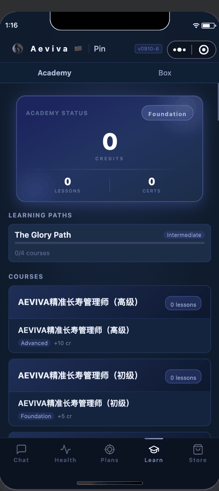

**Box** — reference material: guided audio such as sleep tracks (which keep playing in the
background), videos, documents, and where available a download link for the companion device app.

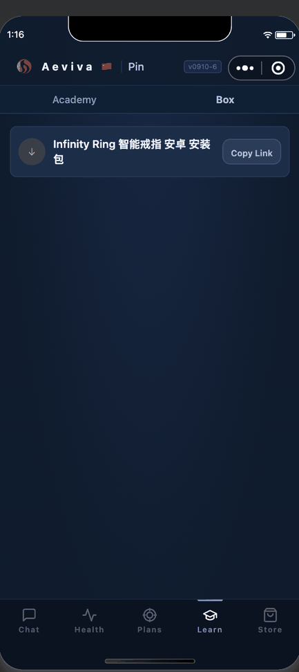

---

## The Store

On **Aeviva** channels the **Store** tab opens the Aeviva storefront in a web view rather than an
in-app tab. You'll be asked to verify your phone number the first time.

On other channels the Store is native and paid for in **credits**:

- Browse under **Products**; some items have size or variant options.
- Add to cart, then tap the cart bar to review and check out with a recipient name, phone and address
  (or pull in your saved WeChat address).
- If you're short on credits, the app tells you exactly how many more you need.
- **My Orders** tracks past orders — pending ones can be cancelled, and shipped ones show a tracking
  number you can copy.

Your credit balance is shown at the top of the Store tab and in the menu.

---

## Notifications & Reminders

Reminders — set by you, your coach, or your AI companion — appear under **Upcoming Reminders** on the
Plans tab, and arrive in chat when due.

Longer-running work (Formulate Dots, Health Advice, Viva AG, and in-depth chat replies) delivers its
result as a notification once ready, even if you've left the screen. If a reply seems to be taking a
long time, it is still running on the server — reopen the chat later and it will be waiting.

---

## Inviting Friends

Open **Invite Friends** from the menu to find your personal referral code.

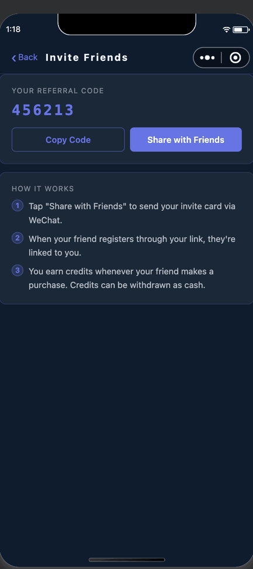

**Share with Friends** sends your invite card through WeChat. When someone registers through your
link they're linked to you, and you earn credits whenever they make a purchase. Credits can later be
requested for withdrawal.

---

## Account & Settings

Tap the header — the logo and your name — to open the menu.

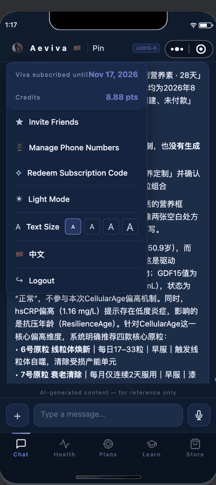

| Entry | What it does |
|---|---|
| **Viva subscribed until** | Your subscription end date (Aeviva, Viva companions). Tap to redeem a code. |
| **Credits** | Your balance. Tap to open Invite Friends. |
| **Invite Friends** | Your referral code and share card. |
| **Manage Phone Numbers** | Add, remove or re-prioritize your numbers. |
| **Redeem Subscription Code** | Enter a subscription code. |
| **Light / Dark Mode** | Switch the colour theme. |
| **Text Size** | Four steps; the app resizes behind the menu as you tap. |
| **中文 / English** | Switch language. The whole app re-renders immediately. |
| **Logout** | Signs you out to the "continue as previous account" screen. |

### Phone numbers

You can hold more than one verified number, and **any** of them signs you into the same account — not
just the primary one.

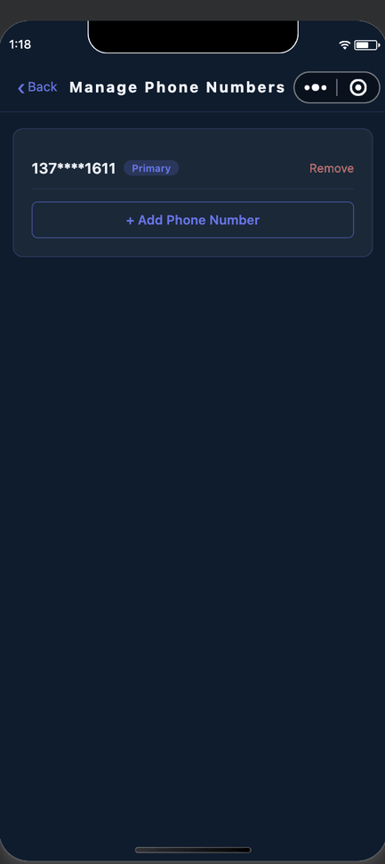

**+ Add Phone Number** verifies a new number by SMS code. From the list you can promote another
number to primary or remove one.

### Avatars

Avatars come from a gallery of pre-made characters — there's no photo upload. Pick one from the
Health tab by tapping your avatar or **Edit Profile**. On your own Health tab the avatar also shifts
expression to reflect your recent wearable data.

### Language

Switching language re-renders the whole app immediately. Note that it resets to your account's own
language setting when the app restarts, and that the sign-in and phone-verification screens are
Chinese only.

---

If you also hold a **coach**, **channel admin**, or **superadmin** role, the menu shows extra entries
for those panels — see the [Coach Guide](coach-guide.md) and [Admin Guide](admin-guide.md).
